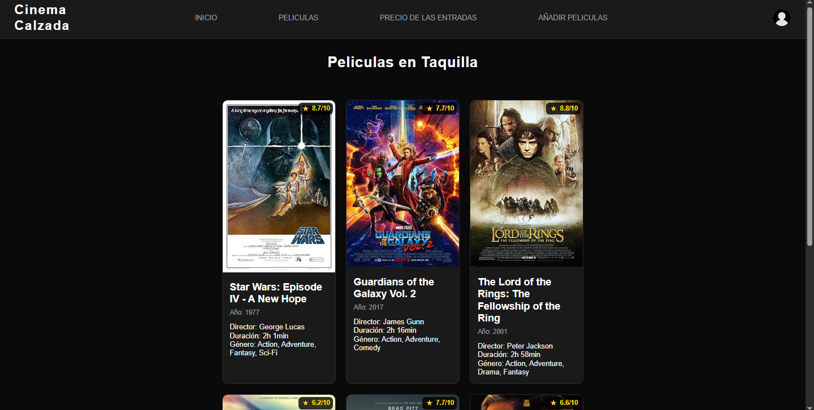
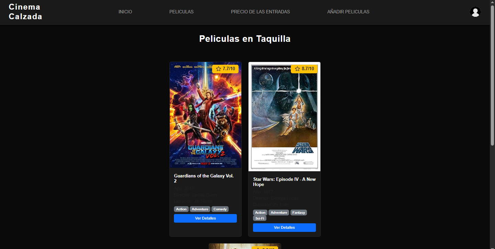
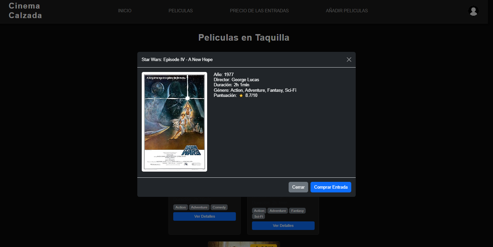
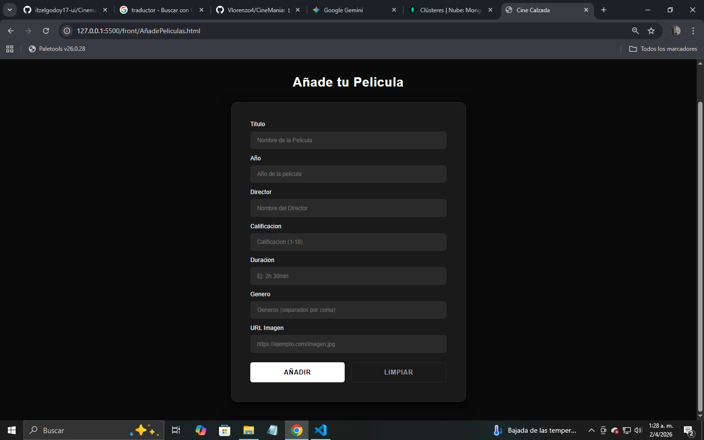

# 🎬 CinemaCalzada - Movie Management System

A dynamic web platform designed for movie enthusiasts and cinema administrators. This project focuses on efficient data handling, seamless user experience, and a robust movie catalog management.

### 🚀 Key Features
- **Interactive Catalog:** Browse movies with real-time details.
- **Admin Dashboard:** Full CRUD operations for managing the movie database.
- **Responsive Design:** Optimized for a smooth experience across all devices.
- **Form Validation:** Client-side validation for secure and accurate data entry.

### 🛠️ Tech Stack
- **Front-End:** JavaScript, HTML, CSS, Bootstrap.
- **Back-End Integration:** RESTful API communication using Axios.
- **Development Tools:** Git for version control and modular architecture.

### 📂 Project Structure
- `scripts/`: Logic for API requests and DOM manipulation.
- `styles/`: Modular CSS for a clean and modern UI.
- `assets/`: Optimized media and icons.

---

### 📸 Preview

  
  
  
  

